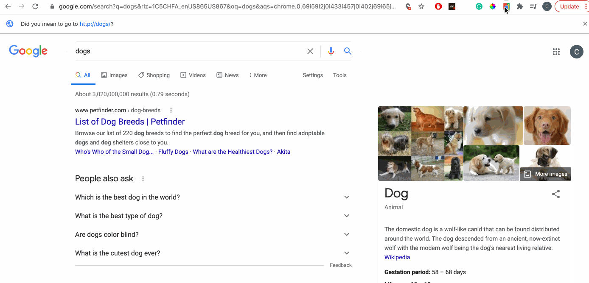
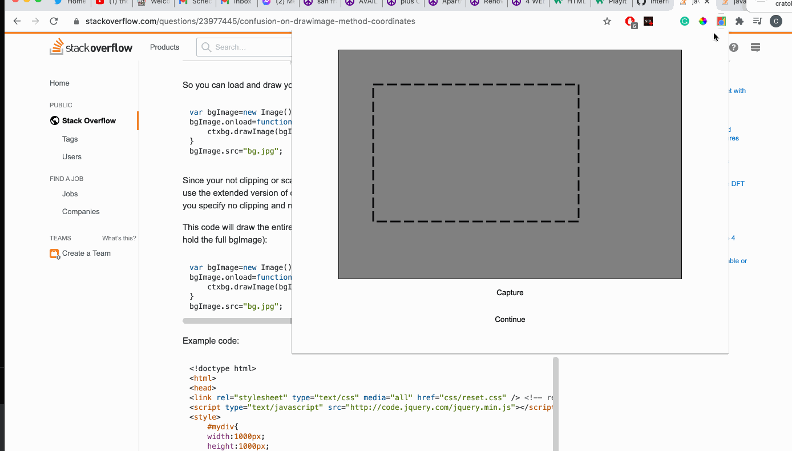
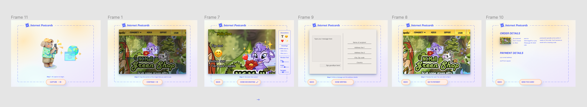
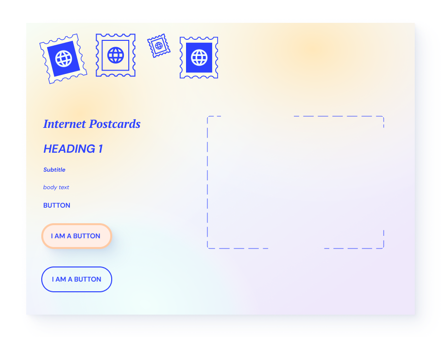

# Progress log

## 02/26/21

- Set up new extension
- Looked into chrome store payment terms of service
  - they deprecated their built-in payment platform a few years back and basically say to use whatever payment platform that you'd like
- got the image grabbing working

## 03/05/21

- question for the class: think about how to prevent IP theft?
  - I don't want to make easy for people to make random postcards using other people's art
  - one solution could be making the blocky website title a requirement instead of a nice add-on
  - will people be mad if someone uses their website for a postcard????
- what are other things that might be concerning / that I'd get roasted for online? it's really easy to overlook this kind of stuff and I want to make sure I'm not missing anything

## 03/12/21

- made design system for UI, mocked up the whole flow
- built UI up to the deocration screen
- covered every possible edge case for the screen aspect ratio of the rect cutter
